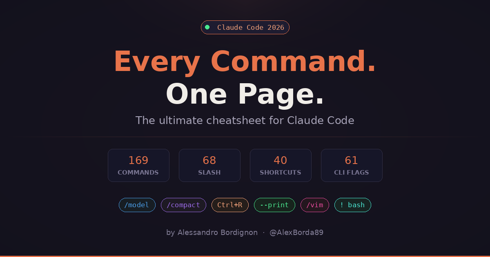

# Claude Code — The Ultimate Cheatsheet

Hey! I got tired of googling Claude Code commands every 5 minutes, so I made this.

One single page with **every command, shortcut, and flag** that exists in Claude Code. All in one place. No more jumping between docs.

## What's inside

169 commands total. Yeah, that's a lot. I organized them so you don't go crazy:

- **68 Slash Commands** — all the `/something` you can type
- **40 Keyboard Shortcuts** — Ctrl+this, Alt+that, Vim stuff
- **61 CLI Flags** — all the `--something` when you launch claude from terminal

Every single card is **clickable** — click it and you get the full syntax, a real example, and tips on how to use it. Nothing is made up, everything comes from the official docs.

## How to use it

- Open the page
- Press `/` to search for anything
- Click the category chips to filter (Slash, Shortcuts, Flags, etc.)
- Click any card to see details and examples
- Press `Esc` to clear search

That's it. Simple.

## It's just one HTML file

No frameworks. No build step. No npm install. No node_modules folder bigger than your project. Just one `index.html` file. Open it in your browser and you're good.

Want to host it somewhere? Drop it on Vercel, Netlify, Cloudflare Pages, or just enable GitHub Pages on this repo. Done.

## Why I made this

I use Claude Code every day and I kept forgetting commands. Like, what was the shortcut to switch models again? Or how do I resume a session by name? Now I just open this page and search.

If you find it useful, share it with someone who's learning Claude Code. It's free, it's open, it's yours.

## Made by

[Alessandro Bordignon](https://x.com/AlexBorda89) — follow me on X if you want, I post about AI and dev stuff.

## License

MIT — do whatever you want with it. See [LICENSE](LICENSE) for details.
